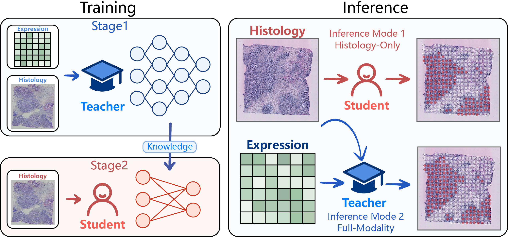
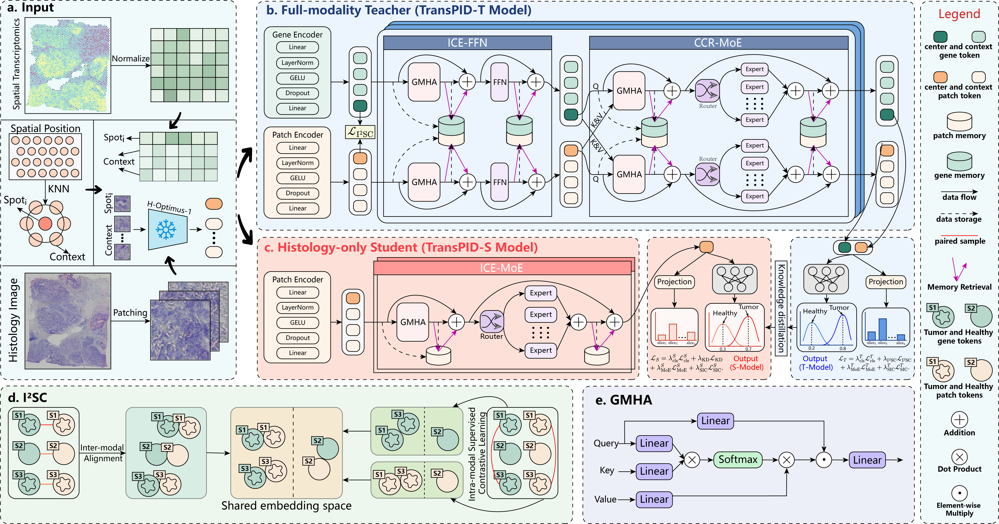

# TransPID

**TransPID: Transcriptome-Privileged Information Distillation for Modality-Flexible Cancer-Region Classification**

This repository provides the implementation of TransPID, a modality-flexible framework for spatial cancer-region classification. During training, the full-modality teacher, TransPID-T, learns from paired histology and spatial gene expression. Its task-relevant molecular knowledge is then transferred to the histology-only student, TransPID-S, which does not require gene expression at inference time.

## Overview

Spatial transcriptomics links tissue morphology with spatially resolved gene expression, but transcriptomic measurements may be costly or unavailable in routine deployment. TransPID addresses this limitation through privileged-information distillation:

- **TransPID-T** integrates histology and gene expression during training.
- **TransPID-S** uses only histology for inference.
- **I²SC** aligns paired modalities while preserving class structure.
- **MAGCR** retrieves informative intra- and cross-modal context.
- **SIC** reduces slide-specific shortcut learning.

<p align="center">
  
</p>

<p align="center"><em>Figure 1. Overview of TransPID training and inference.
    TransPID-T uses histology and gene expression, whereas TransPID-S
    performs histology-only prediction through knowledge distilled
    from TransPID-T.</em></p>

<p align="center">
  
</p>

<p align="center"><em>Figure 2. Overview of TransPID. (a) Histology, gene expression,
and spatial neighborhoods are constructed for each center spot.
(b) TransPID-T integrates both modalities using I²SC and memory-augmented
intra- and cross-modal context retrieval. (c) TransPID-S retains the
histology branch and learns from TransPID-T through knowledge distillation.
(d) I²SC aligns paired modalities while preserving class structure.
(e) Details of gated multi-head attention (GMHA).</em></p>

## Datasets

The experiments contain 23 tissue sections from breast and colorectal cancer cohorts.

| Dataset | Cancer type | Platform | Sections | Spots | Cancer spots (%) | Original source |
| --- | --- | --- | ---: | ---: | ---: | --- |
| STHBC | Breast cancer | Spatial Transcriptomics | 8 | 3,481 | 1,896 (54.47%) | [HER2ST](https://github.com/almaan/her2st) |
| CRC | Colorectal cancer | 10x Visium | 12 | 17,392 | 7,774 (44.70%) | [Zenodo record 7760264](https://zenodo.org/records/7760264) |
| ViHBC1 | Breast cancer | Visium | 1 | 3,798 | 2,490 (65.56%) | [10x Genomics](https://www.10xgenomics.com/datasets/human-breast-cancer-block-a-section-1-1-standard-1-1-0) |
| ViHBC2 | Breast cancer | Visium | 1 | 4,727 | 2,609 (55.19%) | [10x Genomics](https://www.10xgenomics.com/datasets/invasive-ductal-carcinoma-stained-with-fluorescent-cd-3-antibody-1-standard-1-2-0) |
| ViHBC3 | Breast cancer | Visium | 1 | 4,992 | 1,522 (30.49%) | [10x Genomics](https://www.10xgenomics.com/products/xenium-in-situ/preview-dataset-human-breast) |
| **Total** | — | — | **23** | **34,390** | **16,291 (47.37%)** | — |

The spot statistics are calculated from the processed `.h5ad` files used in the experiments.

We will also provide a standardized archive containing the organized raw data and the processed `.h5ad` files:

> **TransPID data archive:** [Zenodo DOI pending](https://doi.org/10.5281/zenodo.XXXXXXX)

## Data Organization

The raw data directory is external to this repository and can be placed anywhere. When preprocessing, set `raw_data_root` in the corresponding script under `data_process/` to an absolute path, such as `/data/transpid` or `C:/project/data`.

```text
raw_data_root/
├── STHBC/
│   ├── ST-cnts/
│   ├── ST-imgs/
│   ├── ST-spotfiles/
│   └── ST-pat/lbl/
├── CRC/
│   ├── Pathology_SpotAnnotations/
│   └── <slice>/
│       ├── filtered_feature_bc_matrix.h5
│       └── spatial/
├── ViHBC1/
│   ├── filtered_feature_bc_matrix.h5
│   ├── truth.txt
│   ├── tissue_full_image.png
│   └── spatial/
├── ViHBC2/
│   ├── filtered_feature_bc_matrix.h5
│   ├── Visium_IDC_label.txt
│   ├── V1_Human_Invasive_Ductal_Carcinoma_image.png
│   └── spatial/
└── ViHBC3/
    ├── filtered_feature_bc_matrix.h5
    ├── labels.xlsx
    ├── CytAssist_FFPE_Human_Breast_Cancer_tissue_image.png
    └── spatial/
```

The preprocessing scripts in [`data_process`](data_process) convert the raw datasets into the project-local `processed_data/` directory. The released Zenodo archive will include these processed files, so feature extraction can be skipped when reproducing the reported experiments.

```text
processed_data/
├── STHBC/
├── CRC/
├── STHBC2ViHBC/
├── ViHBC2STHBC/
├── HBC2CRC/
└── CRC2HBC/
```

Each processed `.h5ad` file contains normalized expression features, binary cancer labels, spatial coordinates, and frozen H-Optimus-1 histology features. Preprocessing from raw images requires the H-Optimus-1 checkpoint; training from the released processed files does not.

## Installation

The code was tested with Python 3.10, PyTorch 2.3.1, and CUDA 11.8. A CUDA-enabled GPU is recommended.

```bash
git clone https://github.com/wenwenmin/TransPID.git
cd TransPID

conda create -n transpid python=3.10 -y
conda activate transpid

pip install torch==2.3.1 torchvision==0.18.1 \
  --index-url https://download.pytorch.org/whl/cu118

pip install \
  pytorch-lightning==2.6.1 \
  torchmetrics==1.9.0 \
  hydra-core==1.3.2 \
  omegaconf==2.3.0 \
  numpy==2.2.6 \
  pandas==2.3.3 \
  scipy==1.15.3 \
  scikit-learn==1.7.2 \
  scanpy==1.11.5 \
  anndata==0.11.4 \
  timm==1.0.26 \
  huggingface-hub==0.36.2 \
  transformers==4.51.3 \
  pillow==12.1.1 \
  harmonypy==2.0.0 \
  openpyxl==3.1.5 \
  scikit-misc==0.5.2 \
  matplotlib==3.10.8 \
  seaborn==0.13.2 \
  notebook
```
## Reproduction

The easiest entry point is the [`tutorial.ipynb`](tutorial.ipynb) notebook:

The six supported experiments are:

| Experiment | Evaluation setting | Training runs per seed | Test sections |
| --- | --- | ---: | ---: |
| `STHBC` | STHBC leave-one-out cross-validation | 8 | 8 |
| `CRC` | CRC leave-one-out cross-validation | 12 | 12 |
| `STHBC2ViHBC` | Cross-platform transfer | 1 | 3 |
| `ViHBC2STHBC` | Cross-platform transfer | 1 | 8 |
| `HBC2CRC` | Cross-cancer transfer | 1 | 12 |
| `CRC2HBC` | Cross-cancer transfer | 1 | 11 |
